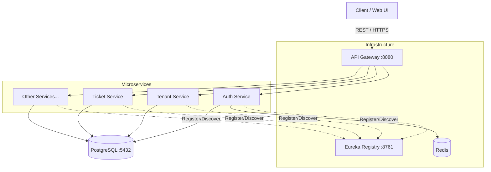

# TechDesk Backend Services

## Overview
TechDesk is a production-grade, multi-tenant IT Service Management (ITSM) platform. The backend is designed as a highly scalable microservices architecture utilizing Spring Boot 3.x and Java 17. It provides fully isolated PostgreSQL schema-level data separation for each tenant (company), enabling secure processing of employee IT support tickets, gadget procurement, asset tracking, Role-Based Access Control (RBAC), and SLA enforcement.

## Architecture

### System Topology
The platform is composed of 13 independent microservices communicating via a centralized Spring Cloud API Gateway and orchestrated using Docker Compose. 



### Internal Service Architecture
Each microservice strictly adheres to a decoupled, layered architectural pattern to ensure clean code modularity:
* **Controllers**: Handles REST API routing, input validation, and maps requests to DTOs.
* **Services**: Encapsulates core business logic, tenant isolation checks, and transaction management (`@Transactional`).
* **Repositories**: Manages data persistence via Spring Data JPA and custom Hibernate multi-tenancy configurations.
* **Security Context**: Validates JWTs internally ensuring zero-trust communication.

### Core Infrastructure Components
* **API Gateway**: Provides dynamic routing, JWT validation, and tenant context extraction while enforcing edge security.
* **Eureka Server**: Facilitates dynamic service discovery and client-side load balancing.
* **Database**: PostgreSQL 15 deployed with strict schema-per-tenant isolation.
* **Migrations**: Automated schema versioning via Flyway, dynamically segregating public platform tables from isolated tenant tables on startup.
* **Caching & Tokens**: Redis for high-speed token blacklisting and refresh token rotation.
* **Email Testing**: Mailhog for localized SMTP testing.

## Microservices Topology
Our domain-driven design splits the application into the following decoupled services:
1. **API Gateway (`api-gateway`)**: Entry point for all client requests.
2. **Service Registry (`eureka-server`)**: Internal registry for microservice discovery.
3. **Auth Service (`auth-service`)**: Handles JWT generation, RBAC, and refresh token rotation via Redis.
4. **Tenant Service (`tenant-service`)**: Manages tenant onboarding and dynamic Flyway schema generation.
5. **Ticket Service (`ticket-service`)**: Core ITSM ticketing engine with Hibernate SPI multi-tenancy.
6. **User Service (`user-service`)**: Manages employee profiles and hierarchy within a tenant.
7. **Asset Service (`asset-service`)**: Tracks physical and digital hardware inventory.
8. **Gadget Service (`gadget-service`)**: Procurement and catalog management.
9. **File Service (`file-service`)**: Handles secure attachment uploads and storage.
10. **Notification Service (`notification-service`)**: Asynchronous email and push notifications.
11. **SLA Service (`sla-service`)**: Enforces response/resolution time policies.
12. **Report Service (`report-service`)**: Generates analytics and KPI dashboards.
13. **Audit Service (`audit-service`)**: Centralized logging for compliance.

## Tech Stack
* **Language**: Java 17
* **Framework**: Spring Boot 3.2.5 / Spring Cloud 2023.0.1
* **Database**: PostgreSQL 15 (Schema-per-tenant)
* **ORM & Data Isolation**: Hibernate 6 with custom `MultiTenantConnectionProvider` and `StatementInspector`
* **Authentication**: Stateless JWT with asymmetric signing (RSA)
* **Containerization**: Docker & Docker Compose
* **Testing**: JUnit 5, Mockito

## Local Development Setup

### Prerequisites
* JDK 17
* Maven 3.8+
* Docker Desktop

### Environment Configuration
Copy the `.env.example` file to `.env` in the root directory and populate the required database and secret values. 
*Note: As per security guidelines, sensitive `application.yml` configurations are excluded from version control.*

### Running the Application

1. **Build all microservices:**
   ```bash
   mvn clean package -DskipTests
   ```

2. **Spin up the infrastructure:**
   ```bash
   docker-compose up -d --build
   ```

3. **Verify the services:**
   * Eureka Registry: http://localhost:8761
   * API Gateway: http://localhost:8080
   * PostgreSQL Admin: http://localhost:5050
   * Mailhog UI: http://localhost:8025

## Enterprise Patterns Implemented
* **True Schema-per-tenant Multi-Tenancy**: Prevents cross-tenant data bleed at the connection and SQL statement levels using custom Hibernate guards.
* **Decoupled Failure Domains**: An outage in `notification-service` will not crash the `ticket-service`.
* **Centralized Routing**: API Gateway masks the complexity of the internal Docker network from the frontend clients.

## Roadmap (Upcoming Phases)
* **Phase 4 (Modularity)**: Extraction of shared logic (JWT Filters, Exception Handlers) into a centralized `techdesk-common` Maven module to enforce DRY principles.
* **Phase 4 (Messaging)**: Integration of RabbitMQ for asynchronous service-to-service communication.
* **Phase 5 (Observability)**: Implementation of Distributed Tracing (Zipkin/OpenTelemetry) for advanced debugging.

## License
Confidential - Adept Tech Solutions | Internal Use Only
